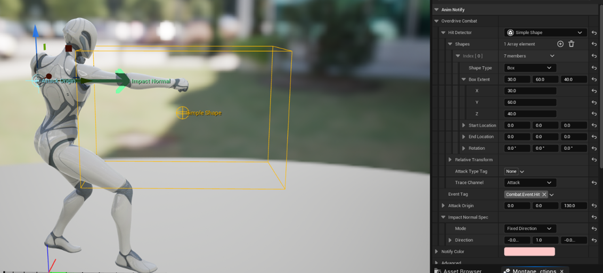
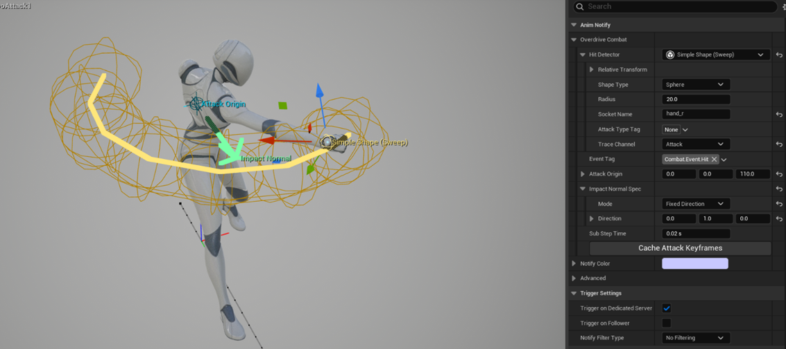

# OverdriveCombat

Unreal Engine 5.8 플러그인. 애니메이션 기반 **히트 판정**과 GAS 기반 **데미지 파이프라인**을 제공하는 근접 전투 프레임워크.

## 개요

두 축으로 나뉜다.

1. **판정** — 애님 노티파이가 공격 프레임에 트레이스를 돌려 맞은 대상을 `TargetData`로 묶고, 공격자에게 GameplayEvent로 보낸다.
2. **적용** — 데미지가 어트리뷰트에 반영되기 전에 **DamageApplier 체인**을 통과한다. 배리어가 먼저 흡수하고 남은 만큼 체력이 깎이는 식으로, 단계를 자유롭게 끼워 넣을 수 있다.

두 축은 분리되어 있다. 판정 없이 데미지만 쓰거나, 판정 결과를 직접 처리해도 된다.

## 모듈 구성

| 모듈 | 타입 | 역할 |
|---|---|---|
| `OverdriveCombat` | Runtime | 히트 판정, 데미지 파이프라인, 배리어, 어트리뷰트 세트 |
| `OverdriveCombatEditor` | Editor | 판정 영역 뷰포트 기즈모, 팩토리 |

## 주요 기능

### 히트 판정 애님 노티파이

| 노티파이 | 방식 |
|---|---|
| `OverdriveCombatAnimNotify_Attack` | 단발(Burst) — 해당 프레임에 한 번 판정 |
| `OverdriveCombatAnimNotifyState_Attack` | 구간(Sweep) — 에디터에서 베이크한 앵커 궤적을 애니메이션 시간에 맞춰 세그먼트 단위로 스윕 |



*단발(Burst) — `Simple Shape`(Box) 판정 영역과 `Attack Origin` · `Impact Normal` 핸들이 뷰포트에 함께 표시된다.*



*구간(Sweep) — `hand_r` 소켓에 붙인 Sphere가 노티파이 구간 전체에 걸쳐 베이크된 앵커 궤적(노란 선)으로 표시된다.*

디텍터는 교체 가능한 Instanced 오브젝트다. 기본 제공은 `SimpleShape`(구/캡슐/박스)이며, 상속해 커스텀 판정을 만들 수 있다.

Sweep 노티파이의 앵커 궤적은 런타임이 아니라 **에디터에서 미리 굽는다**. 디테일 패널의 `Cache Attack Keyframes` 버튼이 노티파이 구간을 `Sub Step Time`(초) 단위로 샘플링해 소켓의 컴포넌트 상대 트랜스폼을 저장한다. 애니메이션을 수정했다면 다시 눌러야 한다.

같은 컴포넌트에 여러 번 맞으면 **공격 원점에 가장 가까운 히트**만 남긴다(가장 먼저 걸린 히트가 아니다).

### ImpactNormal 재계산

트레이스가 준 노멀은 표면 방향이라 넉백·이펙트 방향으로 쓰기엔 부적절할 때가 많다. 노티파이에서 규칙을 지정해 다시 계산한다.

| 모드 | 결과 |
|---|---|
| `Keep Hit Normal` | 트레이스 노멀 유지 |
| `From Origin` | 공격 원점 → 히트 지점 (바깥으로) |
| `Toward Origin` | 히트 지점 → 공격 원점 (빨아들이기) |
| `Fixed Direction` | 컴포넌트 공간 기준 고정 방향 |

여기 없는 규칙이 필요하면 이벤트를 받은 어빌리티가 `TargetData`의 `HitResult`와 `GetOrigin()`으로 직접 계산한다.

### 에디터 뷰포트 기즈모

애니메이션 에디터에서 노티파이를 선택하면 판정 영역(반지름·오프셋·Fixed Direction)을 뷰포트 핸들로 직접 조작할 수 있다. `IPersonaEditMode` 기반이다.

> 참고: `MakeEditWidget` 메타는 레벨 에디터 전용이라 노티파이에는 동작하지 않는다. 그래서 전용 에디트 모드를 구현했다.

### 데미지 파이프라인

```
GameplayEffect (Damage Execution)
        │
        ▼
AttributeSet_Damage::PostGameplayEffectExecute   ← 서버 전용
        │
        ▼
UOverdriveCombatComponent::ApplyDamage
        │
        ├─ Optional DamageAppliers (배리어 등, 등록 순)
        └─ Default DamageApplier (보통 체력)
```

`UOverdriveCombatDamageApplier`는 `Blueprintable` + `EditInlineNew`다. `ApplyDamage(float& InDamage, const FGameplayEffectSpec& Spec)`에서 데미지를 소비·변형하고 `AddAttributeModifier`로 어트리뷰트에 반영한다.

`Spec`을 통해 GE의 에셋 태그·SetByCaller·EffectContext를 모두 볼 수 있어, 공격 유형별로 다르게 반응할 수 있다. 단 `Spec`은 호출 구간에서만 유효하니 멤버로 보관하면 안 된다.

### 배리어

`UOverdriveCombatBarrier` — 데미지 파이프라인 앞단에 끼어드는 보호막. GameplayEffect로 지속시간을 관리한다.

- 파괴 시(`OnBreakBarrier`) / 만료 시(`OnBarrierDurationEnd`) 델리게이트 — C++·BP 양쪽 제공
- 수명은 대상 `UOverdriveCombatComponent`의 강참조(`RegisterBarrier`)가 보증한다. Outer 체인이나 약참조는 GC를 막지 못한다
- 제거는 `MarkAsGarbage` 대신 등록 해제로 처리한다 — 외부가 들고 있는 참조를 밑에서 죽이지 않기 위함

### 어트리뷰트 세트

| 세트 | 어트리뷰트 |
|---|---|
| `AttributeSet_Health` | 체력 |
| `AttributeSet_Barrier` | 배리어 |
| `AttributeSet_Damage` | 데미지 진입점(메타 어트리뷰트) |

### 그 외

- `UOverdriveCombatComponent::ApplyHitStop` — GE 기반 타격 정지
- `UOverdriveCombatDamageExtender` — 데미지 Execution 단계에 계산을 얹는 확장점
- `FOverdriveCombatTargetData_AttackHit` — 네트워크 직렬화되는 히트 TargetData
- `UOverdriveCombatAbilityTask_WaitAttackTarget` — 히트 이벤트 대기 태스크
- 콘솔 변수로 판정 디버그 드로우

## 요구 사항

- Unreal Engine **5.8**
- 엔진 플러그인: `GameplayAbilities`, `ModularGameplay`

다른 Overdrive 플러그인에는 의존하지 않는다.

## 설치

```bash
cd YourProject/Plugins
git clone https://github.com/Kim-9202/OverdriveCombat.git
```

`.uproject`의 `Plugins` 배열에 추가한 뒤 프로젝트 파일을 재생성하고 빌드한다.

## 상태

개인 개발 중인 플러그인이다. API는 예고 없이 바뀔 수 있다.

## 라이선스

All rights reserved. 열람 목적으로만 공개한다 — 복제·수정·배포·이용을 허가하지 않는다.
